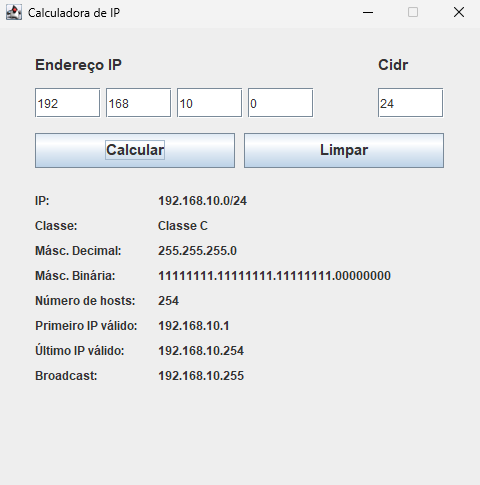

#Calculadora de Sub-redes

#Descrição

Calculadora de sub-redes é uma aplicação Java Swing que fornece uma interface gráfica para calcular e exibir informações detalhadas sobre um endereço IPv4 e sua máscara CIDR. A interface permite que o usuário insira os quatro octetos do endereço IP e o valor CIDR, e ao clicar em "Calcular", exibe dados como:

- Endereço IP completo (com máscara CIDR)

- Classe do IP (A, B ou C)

- Máscara de rede em formato decimal e binário

- Número de hosts válidos na sub-rede

- Primeiro e último IP válidos da rede

- Endereço de broadcast

Também oferece um botão para limpar os campos e resultados da tela.

#Funcionalidades

Entrada dos quatro octetos do IP e CIDR via campos de texto.

Validação dos valores digitados, com mensagem de erro em caso de valores inválidos.

Exibição dos resultados detalhados em painéis organizados.

Interface simples, limpa e responsiva com GridLayout e posicionamento absoluto.

#Autor
Pedro Henrique

